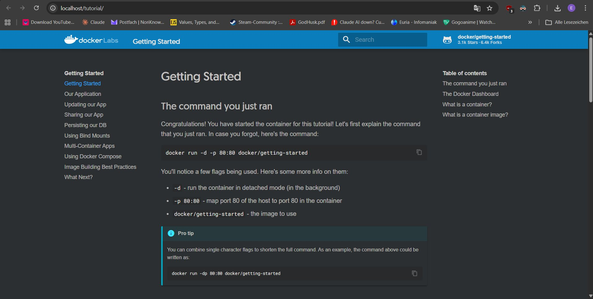
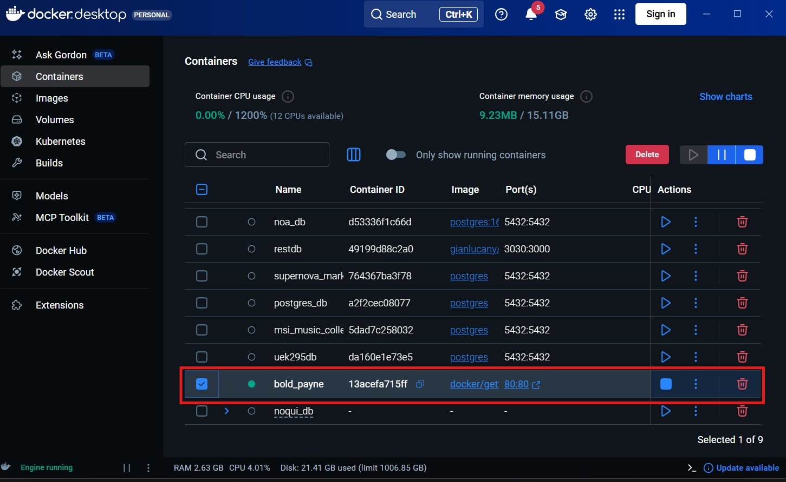
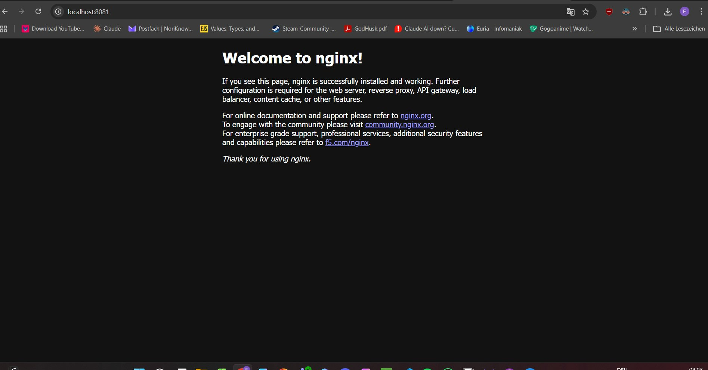
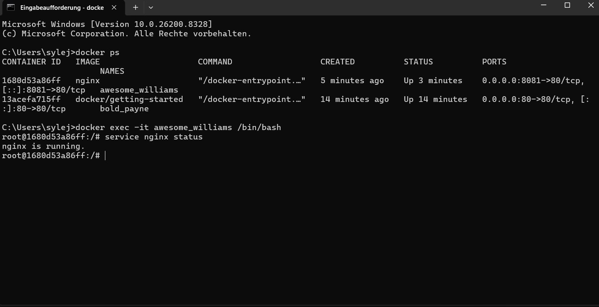
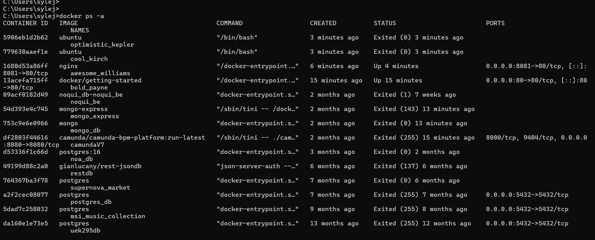
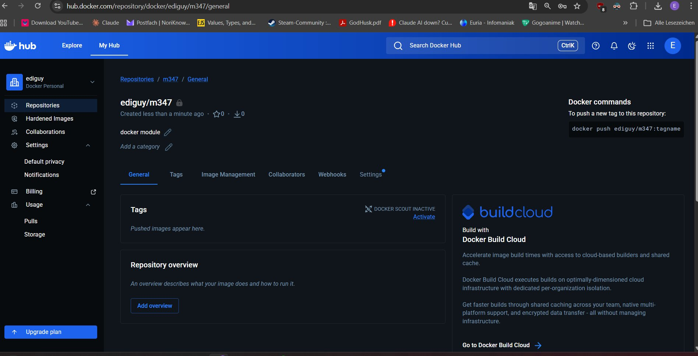
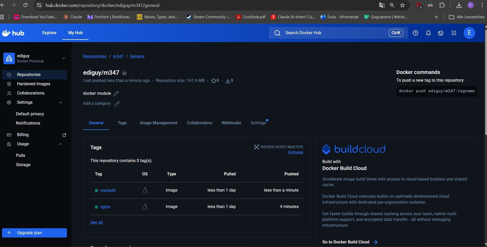

# KN01: Docker Grundlagen

## Inhaltsverzeichnis

- [A) Installation](#a-installation)
- [B) Docker CLI](#b-docker-cli)
- [C) Registry and Repository](#c-registry-and-repository)
- [D) Private Repository](#d-private-repository)

---

## A) Installation


*The getting-started webpage running at localhost:80 after creating the first container.*


*Docker Desktop showing the running bold_payne container (docker/getting-started image).*

---

## B) Docker CLI

### 1. Check Docker version

```
docker version
```

### 2. Search for images on Docker Hub

```
docker search ubuntu
docker search nginx
```

### 3. Explanation of `docker run -d -p 80:80 docker/getting-started`

- `docker run` -> creates and starts a container from an image
- `-d` -> runs the container in the background (detached mode), so the terminal stays usable
- `-p 80:80` -> maps port 80 on the host machine to port 80 inside the container, making it reachable at localhost:80
- `docker/getting-started` -> the name of the image to use; Docker downloads it from Docker Hub automatically if it's not already local

### 4. nginx -> pull, create, start separately

```
docker pull nginx
docker create -p 8081:80 nginx
docker start <container-id>
```

`docker run` is a shortcut that does all three steps at once. Here we ran them separately to understand what each step does individually.


*nginx default page running at localhost:8081.*

### 5. ubuntu -> detached vs interactive

```
docker run -d ubuntu
```

The container started but immediately exited. Ubuntu has no background process to keep it running -> without a terminal there is nothing for it to do, so it stops on its own. The image was downloaded automatically before starting.

```
docker run -it ubuntu
```

This opened a real terminal inside the Ubuntu container. The `-i` flag keeps the input open and `-t` gives it a proper terminal interface. The container stayed alive as long as the shell was open. Typing `exit` closed the shell and stopped the container.

### 6. Open a shell in a running nginx container

```
docker exec -it awesome_williams /bin/bash
service nginx status
exit
```

Unlike `docker run -it`, this doesn't start a new container -> it opens a shell inside one that's already running. After typing `exit`, the container kept running normally.


*Output of `service nginx status` run inside the nginx container, showing nginx is running.*

### 7. Check status of all containers

```
docker ps -a
```


*All containers listed including stopped ones. The two ubuntu containers exited immediately, while nginx and getting-started were still up.*

### 8. Stop the nginx container

```
docker stop awesome_williams
```

### 9. Remove the KN01 containers

```
docker rm 1680d53a86ff 779630aaef1e 13acefa715ff
```

`docker container prune` was not used to avoid removing unrelated stopped containers from other projects.

### 10. Remove the images

```
docker rmi nginx ubuntu docker/getting-started
```

---

## C) Registry and Repository

Created a Docker Hub account with TBZ email. Created a private repository named `m347` under the username `ediguy`.


*The newly created private repository ediguy/m347 with no images yet.*

Logged into Docker Desktop with the new account to get access to the private repository.

---

## D) Private Repository

### Commands used

```
docker pull nginx
docker tag nginx:latest ediguy/m347:nginx
docker push ediguy/m347:nginx
docker pull mariadb
docker tag mariadb:latest ediguy/m347:mariadb
docker push ediguy/m347:mariadb
```

### Explanation

**`docker tag nginx:latest ediguy/m347:nginx`**

`docker tag` creates a new name (tag) pointing to an existing local image. It doesn't copy or download anything -> it just adds another label to the same image. A tag is a version or name label attached to an image, like `latest` or `1.0`. Here we use `nginx` and `mariadb` as tags to identify what each image is inside the repo.

**`docker push ediguy/m347:nginx`**

`docker push` uploads the tagged image from the local machine to Docker Hub. After this the image is stored in the private repository and can be pulled from there by anyone with access.

The same process was repeated for mariadb -> pull the public image, tag it with the private repo name, then push it up.


*The ediguy/m347 repository on Docker Hub showing both the nginx and mariadb tags.*