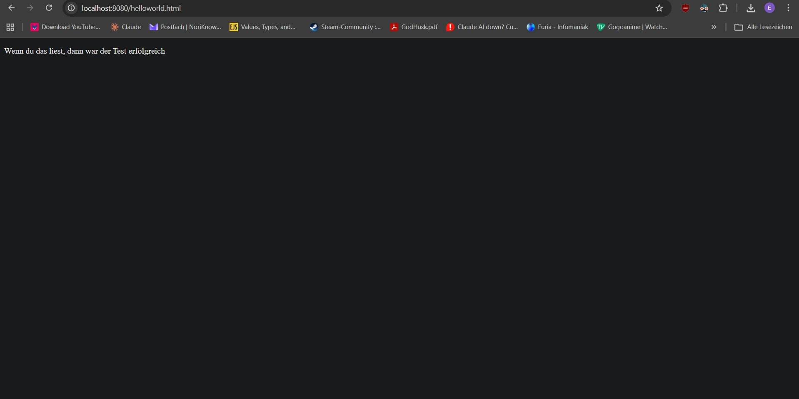
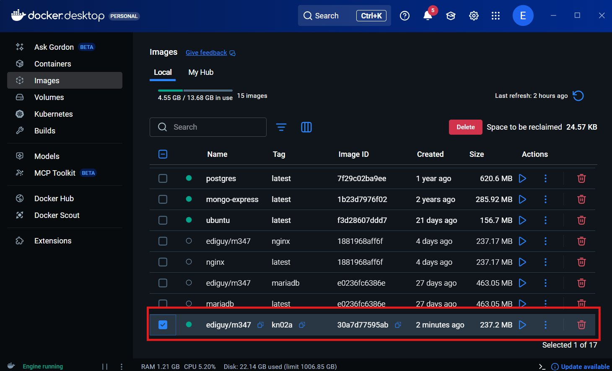
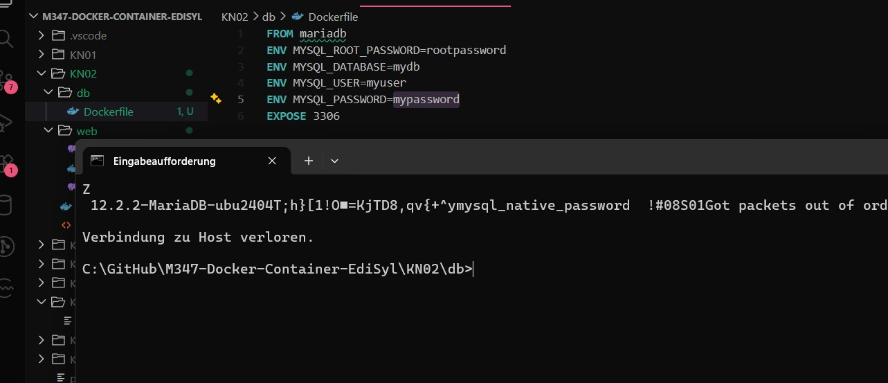
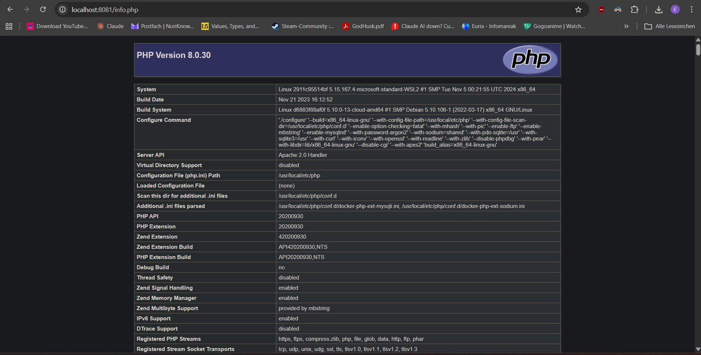
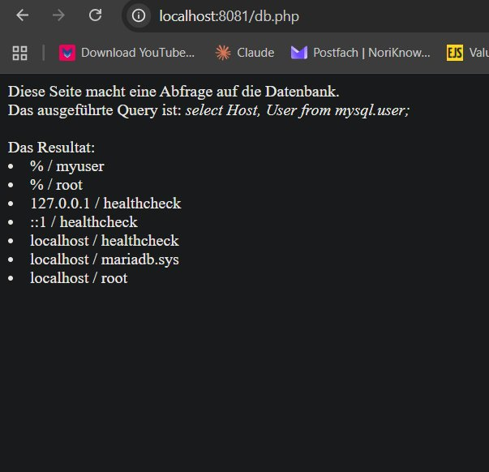

# KN02: Dockerfile

## Inhaltsverzeichnis

- [A) Dockerfile I](#a-dockerfile-i)
- [B) Dockerfile II](#b-dockerfile-ii)

---

## A) Dockerfile I

### Dockerfile

```dockerfile
FROM nginx
WORKDIR /usr/share/nginx/html
COPY helloworld.html .
EXPOSE 80
```

### Dockerfile Explanation

| Line | Explanation |
|------|-------------|
| `FROM nginx` | Uses the official nginx image from Docker Hub as the base |
| `WORKDIR /usr/share/nginx/html` | Sets the working directory to where nginx serves HTML files. All following COPY commands use this as the target |
| `COPY helloworld.html .` | Copies the HTML file into the current working directory inside the container |
| `EXPOSE 80` | Tells Docker that the container listens on port 80. The port still needs to be published with `-p` at runtime |

### Commands

```bash
# Build the image
docker build -t ediguy/m347:kn02a .

# Run the container
docker run -d -p 8080:80 --name kn02a ediguy/m347:kn02a

# Push image to private repository
docker push ediguy/m347:kn02a
```

### Screenshots


*helloworld.html running at localhost:8080 after starting the kn02a container.*


*Docker Desktop Images view showing the kn02a image under ediguy/m347.*

---

## B) Dockerfile II

### B1) Database Container (MariaDB)

#### Dockerfile (db)

```dockerfile
FROM mariadb
ENV MYSQL_ROOT_PASSWORD=rootpassword
ENV MYSQL_DATABASE=mydb
ENV MYSQL_USER=myuser
ENV MYSQL_PASSWORD=mypassword
EXPOSE 3306
```

#### Dockerfile Explanation

| Line | Explanation |
|------|-------------|
| `FROM mariadb` | Uses the official MariaDB image as the base |
| `ENV MYSQL_ROOT_PASSWORD` | Sets the root password directly in the image, no need to pass it manually at runtime |
| `ENV MYSQL_DATABASE` | Automatically creates a database with this name on startup |
| `ENV MYSQL_USER` / `ENV MYSQL_PASSWORD` | Creates an additional user with access to the database |
| `EXPOSE 3306` | The default port for MySQL/MariaDB |

#### Commands

```bash
# Build the image
docker build -t ediguy/m347:kn02b-db .

# Run the container
docker run -d -p 3306:3306 --name kn02b-db ediguy/m347:kn02b-db

# Push image
docker push ediguy/m347:kn02b-db
```

#### Telnet Test

```bash
telnet localhost 3306
```


*Telnet output showing a successful connection to the MariaDB container on port 3306. The garbled text containing "MariaDB" confirms the port is open and the database is running.*

---

### B2) Web Container (PHP + Apache)

#### Dockerfile (web)

```dockerfile
FROM php:8.0-apache
COPY info.php /var/www/html/
COPY db.php /var/www/html/
RUN docker-php-ext-install mysqli
EXPOSE 80
```

#### Dockerfile Explanation

| Line | Explanation |
|------|-------------|
| `FROM php:8.0-apache` | Uses the official PHP image with Apache webserver included |
| `COPY info.php / db.php` | Copies both PHP files into the directory Apache serves files from |
| `RUN docker-php-ext-install mysqli` | Installs the mysqli PHP extension so the app can connect to MariaDB |
| `EXPOSE 80` | The container listens on port 80 |

#### Changes made to db.php

Only the 4 connection variables at the top were changed. The rest of the file (connection logic, SQL query, and result loop) was already in the original and was not modified.

```php
$servername = "kn02b-db";
$username = "root";
$password = "rootpassword";
$dbname = "mysql";
```

| Variable | Before | After | Reason |
|----------|--------|-------|--------|
| `$servername` | `127.0.0.1` | `kn02b-db` | Containers can't communicate via localhost. Docker resolves the container name as a hostname via `--link` |
| `$username` | `admin` | `root` | No user named `admin` exists in the MariaDB image by default |
| `$password` | `???` | `rootpassword` | Matches the `MYSQL_ROOT_PASSWORD` set in the Dockerfile |
| `$dbname` | `mysql` | `mysql` | Unchanged, used to query the system database for the user list |

`info.php` was not changed at all.

#### Commands

```bash
# Build the image
docker build -t ediguy/m347:kn02b-web .

# Run the container (linked to the database)
docker run -d -p 8081:80 --name kn02b-web --link kn02b-db:kn02b-db ediguy/m347:kn02b-web

# Push image
docker push ediguy/m347:kn02b-web
```

The `--link kn02b-db:kn02b-db` flag connects the web container to the DB container by name, so they can communicate with each other.

#### Screenshots


*info.php at localhost:8081/info.php showing PHP Version 8.0.30 with Apache 2.0 Handler.*


*db.php at localhost:8081/db.php showing a successful database query with users from the MariaDB container.*

---

## Images Summary

| Image | Tag | Description |
|-------|-----|-------------|
| `ediguy/m347` | `kn02a` | Nginx web server with helloworld.html |
| `ediguy/m347` | `kn02b-db` | MariaDB database |
| `ediguy/m347` | `kn02b-web` | PHP/Apache web application |
