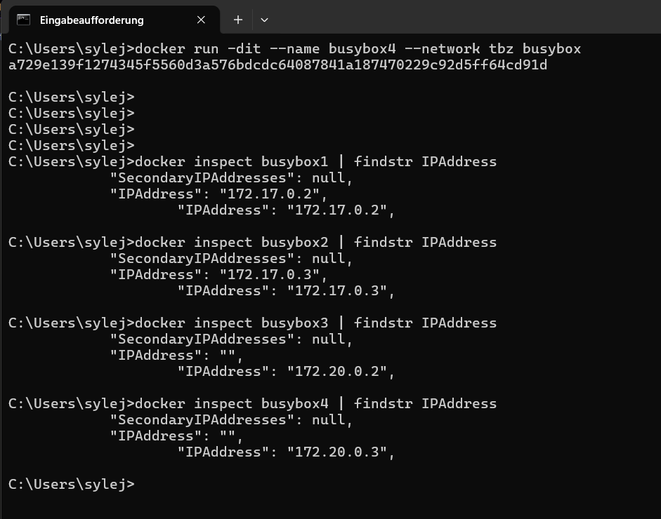
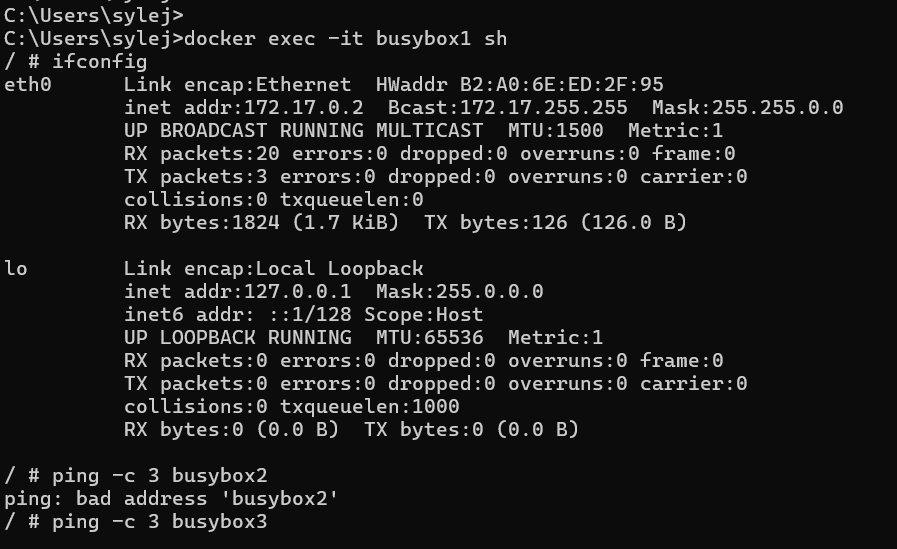
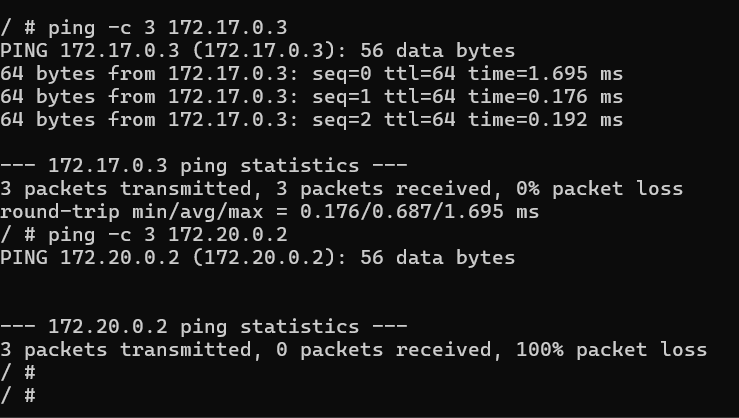
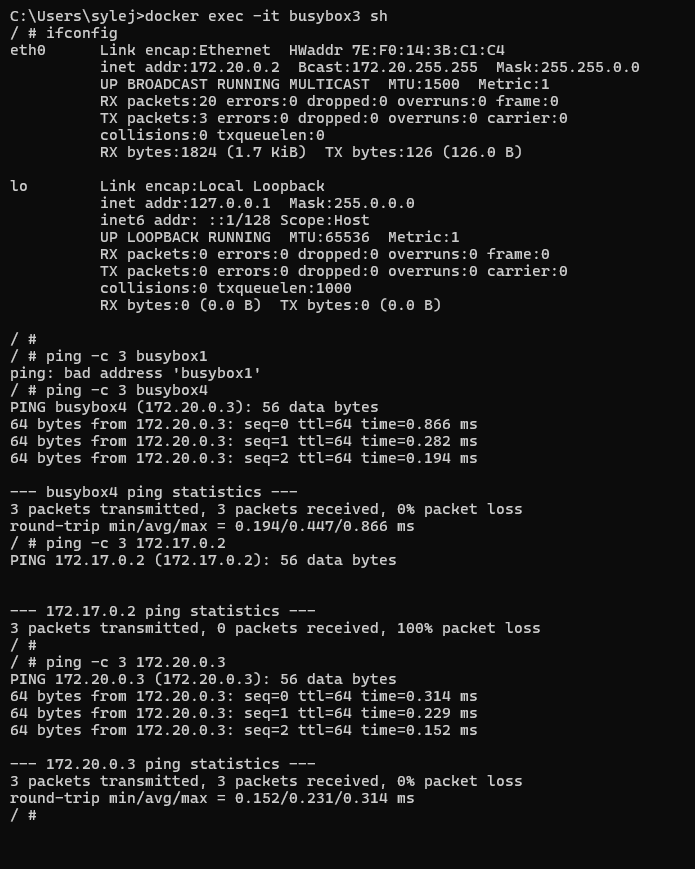

# KN03: Netzwerk, Sicherheit

## Inhaltsverzeichnis

- [A) Eigenes Netzwerk](#a-eigenes-netzwerk)
- [KN02 Reflection](#kn02-reflection)

---

## A) Eigenes Netzwerk

### Network setup

Two containers (busybox1, busybox2) run in the default bridge network. Two containers (busybox3, busybox4) run in a user-defined network called `tbz`.

Note: The assignment specifies subnet `172.18.0.0/16` but this range was already in use by another Docker network on this machine. The subnet `172.20.0.0/16` was used instead — the behavior and results are identical.

### Commands used

```bash
# Create the custom network
docker network create --subnet=172.20.0.0/16 tbz

# Start busybox1 and busybox2 in the default bridge network
docker run -dit --name busybox1 busybox
docker run -dit --name busybox2 busybox

# Start busybox3 and busybox4 in the tbz network
docker run -dit --name busybox3 --network tbz busybox
docker run -dit --name busybox4 --network tbz busybox
```

### IP Addresses

```bash
docker inspect busybox1 | findstr IPAddress
docker inspect busybox2 | findstr IPAddress
docker inspect busybox3 | findstr IPAddress
docker inspect busybox4 | findstr IPAddress
```


*All four containers and their assigned IP addresses.*

| Container | Network | IP Address |
|-----------|---------|------------|
| busybox1 | default bridge | 172.17.0.2 |
| busybox2 | default bridge | 172.17.0.3 |
| busybox3 | tbz | 172.20.0.2 |
| busybox4 | tbz | 172.20.0.3 |

---

### busybox1 session

```bash
docker exec -it busybox1 sh
ifconfig
ping -c 3 busybox2
ping -c 3 busybox3
ping -c 3 172.17.0.3
ping -c 3 172.20.0.2
```


*ifconfig output showing busybox1 is on 172.17.0.2. Pinging busybox2 and busybox3 by name both fail — the default bridge network does not support DNS resolution by container name.*


*Pinging busybox2 by IP (172.17.0.3) succeeds. Pinging busybox3 by IP (172.20.0.2) fails with 100% packet loss — the two networks are completely isolated from each other.*

**Default gateway of busybox1:** `172.17.0.1` — this is the same gateway as busybox2, since both are in the default bridge network.

---

### busybox3 session

```bash
docker exec -it busybox3 sh
ifconfig
ping -c 3 busybox1
ping -c 3 busybox4
ping -c 3 172.17.0.2
ping -c 3 172.20.0.3
```


*ifconfig shows busybox3 is on 172.20.0.2. Pinging busybox1 by name fails (no DNS in tbz for default bridge containers). Pinging busybox4 by name succeeds — user-defined networks support automatic DNS resolution. Pinging busybox1 by IP (172.17.0.2) fails with 100% packet loss. Pinging busybox4 by IP (172.20.0.3) succeeds.*

**Default gateway of busybox3:** `172.20.0.1` — same as busybox4, since both are in the tbz network.

---

### Similarities and differences

| | Default bridge (busybox1/2) | User-defined tbz (busybox3/4) |
|---|---|---|
| Ping by name | Fails | Works (automatic DNS) |
| Ping by IP within same network | Works | Works |
| Ping by IP across networks | Fails | Fails |
| Default gateway | 172.17.0.1 | 172.20.0.1 |

**Conclusion:** Containers in the same network can always reach each other by IP. The key difference is that user-defined networks support DNS resolution by container name, while the default bridge network does not. Containers in different networks are completely isolated — they cannot reach each other by name or by IP, regardless of which network type they are in.

---

## KN02 Reflection

**In which network were the KN02 web and DB containers?**

Both containers were in the default bridge network. They were connected to each other using the `--link` flag, which is a legacy feature of the default bridge network.

**Why did the connection work via the DB container's IP address?**

Within the default bridge network, containers can reach each other by IP address. Since both containers were on the same network, the web container could connect directly to the DB container's IP.

**Why is a hardcoded container IP not ideal?**

Container IP addresses are assigned dynamically by Docker and can change every time a container is recreated. If the IP changes, the connection breaks and the configuration has to be updated manually. This is not reliable in practice.

**Improvement suggestion**

Instead of using `--link` or a hardcoded IP, both containers should be placed in the same user-defined network. User-defined networks support automatic DNS resolution, meaning containers can find each other by name. This is stable even if containers are recreated and their IPs change.

### Improvement — redoing KN02 with a user-defined network

```bash
# Create a dedicated network for KN02
docker network create kn02-net

# Remove the old containers
docker rm -f kn02b-db kn02b-web

# Start the DB container on the new network
docker run -d -p 3306:3306 --name kn02b-db --network kn02-net ediguy/m347:kn02b-db

# Start the web container on the same network (no --link needed)
docker run -d -p 8081:80 --name kn02b-web --network kn02-net ediguy/m347:kn02b-web
```

With both containers on `kn02-net`, the web container can reach the database using `kn02b-db` as the hostname — the same value already set in `db.php`. No `--link` flag is needed and no IP address is hardcoded.


*db.php at localhost:8081/db.php still returns the database query results after switching to the user-defined network, confirming the connection works correctly.*
