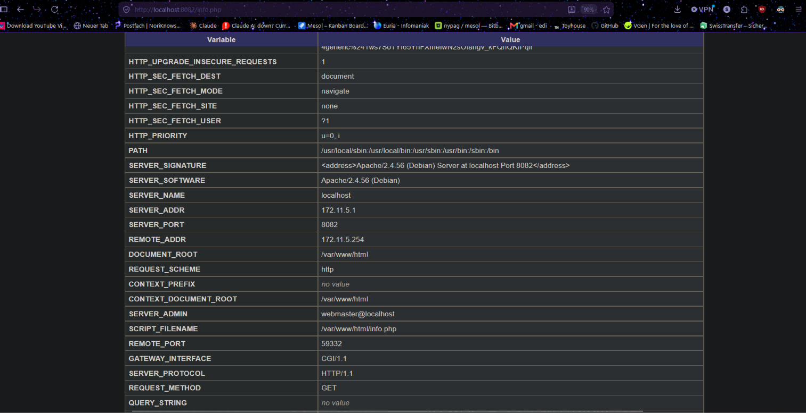
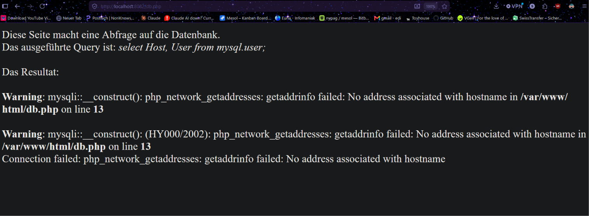

# KN04: Docker Compose

## Inhaltsverzeichnis

- [A) Docker Compose: Lokal](#a-docker-compose-lokal)
  - [Teil a) Original Images](#teil-a-original-images)
  - [Teil b) Eigene Images](#teil-b-eigene-images)
- [B) Docker Compose: Cloud](#b-docker-compose-cloud)

---

## A) Docker Compose: Lokal

### Teil a) Original Images

The two containers from KN02 are started together with a single `docker compose up`. The database uses the `mariadb:latest` image configured directly in the compose file; the web server is built from a Dockerfile. Both run in a user-defined network so they can reach each other by name.

For Teil a the web image is built from the local Dockerfile, so `db.php` is edited to use the DB container name as the hostname:

```php
$servername = "m347-kn04a-db";
```

#### Dockerfile (web)

```dockerfile
FROM php:8.0-apache
COPY info.php /var/www/html/
COPY db.php /var/www/html/
RUN docker-php-ext-install mysqli
EXPOSE 80
```

#### docker-compose.yml

```yaml
services:
  m347-kn04a-db:
    image: mariadb:latest
    container_name: m347-kn04a-db
    environment:
      MYSQL_ROOT_PASSWORD: rootpassword
      MYSQL_DATABASE: mydb
      MYSQL_USER: myuser
      MYSQL_PASSWORD: mypassword
    networks:
      - kn04a-net
  m347-kn04a-web:
    build: .
    container_name: m347-kn04a-web
    ports:
      - "8082:80"
    depends_on:
      - m347-kn04a-db
    networks:
      - kn04a-net
networks:
  kn04a-net:
    driver: bridge
    ipam:
      config:
        - subnet: 172.10.0.0/16
          ip_range: 172.10.5.0/24
          gateway: 172.10.5.254
```

#### Starting the environment

```bash
docker compose up
```


*info.php — REMOTE_ADDR and SERVER_ADDR are both inside the 172.10.5.0/24 range, confirming the containers share the network.*


*db.php at localhost:8082/db.php returns the `mysql.user` query results — the web container resolves the DB by name and the connection works.*

#### What `docker compose up` does

`docker compose up` is a wrapper that bundles several lower-level commands:

| Command | What it does |
|---------|--------------|
| `docker compose build` | Builds the image for any service that defines a `build:` (here the web server) |
| `docker compose pull` | Pulls images that are not present locally (here `mariadb:latest`) |
| `docker network create` | Creates the networks defined in the file (`kn04a-net`) |
| `docker volume create` | Creates any defined volumes (none in this setup) |
| `docker create` | Creates the containers in dependency order (`depends_on`) |
| `docker start` | Starts the created containers |
| *attach* | Streams both containers' logs to the terminal (skipped when run with `-d`) |

---

### Teil b) Eigene Images

The published web image from KN02 (`ediguy/m347:kn02b-web`) is used instead of building locally, so no Dockerfile is needed. The compose file is cleaned up and a **different IP range** (172.11.x) is used.

#### docker-compose.yml

```yaml
services:
  m347-kn04a-db:
    image: mariadb:latest
    container_name: m347-kn04a-db
    environment:
      MYSQL_ROOT_PASSWORD: rootpassword
      MYSQL_DATABASE: mydb
      MYSQL_USER: myuser
      MYSQL_PASSWORD: mypassword
    networks:
      - kn04b-net
  m347-kn04a-web:
    image: ediguy/m347:kn02b-web
    container_name: m347-kn04a-web
    ports:
      - "8082:80"
    depends_on:
      - m347-kn04a-db
    networks:
      - kn04b-net
networks:
  kn04b-net:
    driver: bridge
    ipam:
      config:
        - subnet: 172.11.0.0/16
          ip_range: 172.11.5.0/24
          gateway: 172.11.5.254
```


*info.php — SERVER_ADDR is 172.11.5.1 (web container) and REMOTE_ADDR is 172.11.5.254 (the network gateway). Both sit in 172.11.5.0/24, so the request is served from inside the user-defined network.*


*db.php at localhost:8082/db.php fails: `php_network_getaddresses: getaddrinfo failed: No address associated with hostname`. This error is expected in Teil b.*

#### Why the error occurs

The published image `ediguy/m347:kn02b-web` has `db.php` baked in with the **old KN02 hostname**:

```php
$servername = "kn02b-db";
```

On this network the database container is named `m347-kn04a-db`. Docker's internal DNS only resolves names that actually exist on the network, and there is no container or alias called `kn02b-db`. The lookup therefore fails before any connection is attempted, which is exactly the `getaddrinfo failed` warning shown above.

**How to fix it** (any one of these):

- Give the DB service a network alias so the old name resolves:
  ```yaml
  m347-kn04a-db:
    networks:
      kn04b-net:
        aliases:
          - kn02b-db
  ```
- Rename the DB container/service to `kn02b-db`.
- Rebuild and republish the web image with `db.php` pointing at `m347-kn04a-db`.

---

## B) Docker Compose: Cloud

The same Teil a setup is deployed to a cloud VM. Docker is installed via cloud-init, and the **write_files** and **runcmd** sections are extended to drop in the compose file, the Dockerfile, `info.php` and `db.php`, and then run `docker compose up`. The teacher's public key is added alongside the personal key so the server is reachable over SSH.

The installation can be verified in `/var/log/cloud-init-output.log`; when it finishes, the `final_message` from the cloud-init file is printed.


*info.php on the cloud VM — public URL visible, REMOTE_ADDR and SERVER_ADDR shown.*


*db.php on the cloud VM — public URL visible.*

---

**Conclusion:** Docker Compose starts the whole multi-container setup with one command and a single YAML file instead of a chain of `docker run` commands. The Teil b error shows why hostnames baked into a published image are fragile: if the referenced name does not exist on the network, DNS resolution fails outright. Network aliases or a corrected image keep the setup working without hardcoding anything.