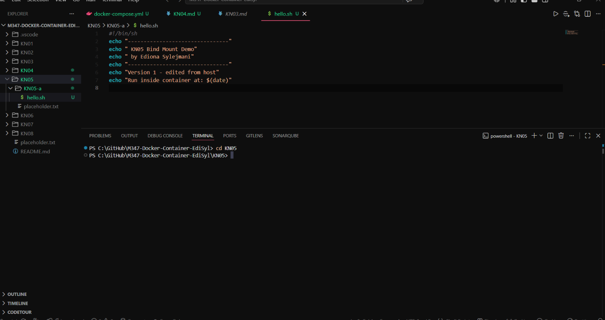
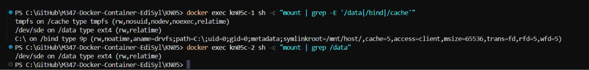

# KN05: Arbeit mit Speicher

## Inhaltsverzeichnis

- [A) Bind mounts](#a-bind-mounts)
- [B) Volumes](#b-volumes)
- [C) Speicher mit docker compose](#c-speicher-mit-docker-compose)

---

## A) Bind mounts

A bind mount shares a folder from the host directly into the container, so code edited on the host is instantly visible inside the container without rebuilding. To show this, a small unique script lives on the host and is executed inside an `nginx` container; the script is then edited on the host and run again.

### Script on the host (`hello.sh`)

```sh
#!/bin/sh
echo "=============================="
echo " KN05 Bind Mount Demo"
echo " by Ediona Sylejmani (Nori)"
echo "=============================="
echo "Version 1 - original script, living on the host"
echo "Run inside container at: $(date)"
```


*The script as it lives on the host, inside the bind-mounted folder.*

### Commands used

```bash
# Start nginx with the current host folder bind-mounted into the container
docker run -dit --name kn05a-web -v ${PWD}:/mnt/host nginx

# Run the script inside the container -> prints "Version 1"
docker exec -it kn05a-web sh /mnt/host/hello.sh

# Edit hello.sh on the host (Version 1 -> Version 2), save, then run again
docker exec -it kn05a-web sh /mnt/host/hello.sh
```

The second run prints **Version 2** even though the container was never rebuilt or restarted — the host and container share the same file through the bind mount.

**Screencast:** [▶ kn05a_bindmount.mp4](vids/kn05a_bindmount.mp4)

---

## B) Volumes

A named volume is managed by Docker itself and can be attached to several containers at once. Two `nginx` containers mount the **same** named volume, then write to and read from a shared file to prove the storage is shared.

### Commands used

```bash
# Create the named volume
docker volume create kn05b-vol

# Start two containers, both mounting the same volume
docker run -dit --name kn05b-1 -v kn05b-vol:/data nginx
docker run -dit --name kn05b-2 -v kn05b-vol:/data nginx

# Container 1 writes a line, container 2 reads it
docker exec -it kn05b-1 sh -c "echo 'written by container 1' >> /data/shared.txt"
docker exec -it kn05b-2 cat /data/shared.txt

# Container 2 appends a line, container 1 reads both
docker exec -it kn05b-2 sh -c "echo 'written by container 2' >> /data/shared.txt"
docker exec -it kn05b-1 cat /data/shared.txt
```

Container 2 reads the line written by container 1, and after container 2 appends its own line, container 1 reads **both** lines back. Each container sees the other's writes, confirming they share the same named volume.

**Screencast:** [▶ kn05b_volume.mp4](vids/kn05b_volume.mp4)

---

## C) Speicher mit docker compose

A single compose file attaches all three storage types to the first container — a named volume (long syntax), a bind mount, and a tmpfs mount — while the second container shares the same named volume using the short syntax.

### docker-compose.yml

```yaml
services:
  kn05c-1:
    image: nginx
    container_name: kn05c-1
    volumes:
      # named volume - LONG syntax
      - type: volume
        source: kn05c-vol
        target: /data
      # bind mount - LONG syntax
      - type: bind
        source: ./kn05c-bind
        target: /bind
      # tmpfs - LONG syntax
      - type: tmpfs
        target: /cache
  kn05c-2:
    image: nginx
    container_name: kn05c-2
    volumes:
      # named volume - SHORT syntax
      - kn05c-vol:/data
volumes:
  kn05c-vol:
```

### Starting and verifying

```bash
mkdir kn05c-bind
docker compose up -d
docker exec kn05c-1 sh -c "mount | grep -E '/data|/bind|/cache'"
docker exec kn05c-2 sh -c "mount | grep /data"
```

### `mount` in the first container (all three types)

```text
tmpfs on /cache type tmpfs (rw,nosuid,nodev,noexec,relatime)
/dev/sde on /data type ext4 (rw,relatime)
C:\ on /bind type 9p (rw,noatime,aname=drvfs;path=C:\;...)
```

- `/cache` → **tmpfs** (in-memory storage)
- `/data` → **named volume** (`ext4`)
- `/bind` → **bind mount** (`9p` is how WSL2 maps the Windows folder into Linux)

### `mount` in the second container (shared named volume)

```text
/dev/sde on /data type ext4 (rw,relatime)
```

Container 2 shows the same `/data` mount — both containers share the `kn05c-vol` named volume.


*Top: container 1 with all three storage types. Bottom: container 2 with the shared named volume.*

---

**Conclusion:** The three storage types serve different purposes. A bind mount links a host folder for live editing during development; a named volume is Docker-managed persistent storage that can be shared across containers; and tmpfs keeps data in memory only, gone when the container stops. Docker Compose can attach all of them to a container through either the long or the short volume syntax.
