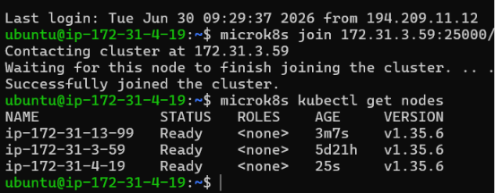
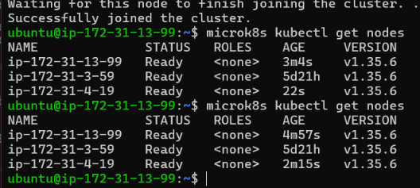
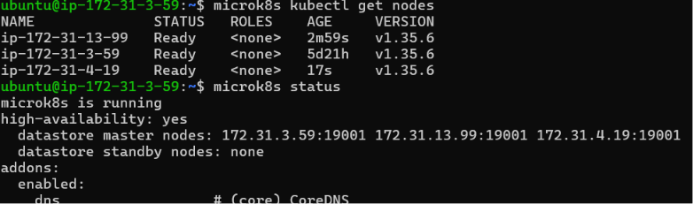
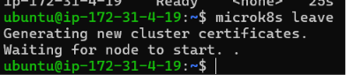
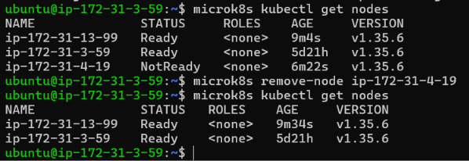
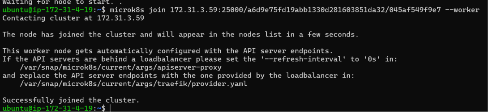
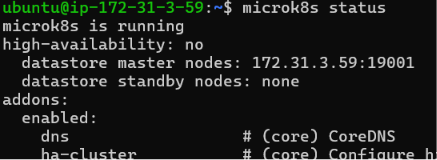
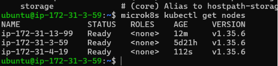
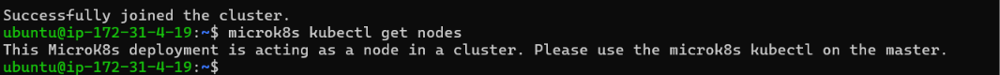

# KN06: Kubernetes I

## Inhaltsverzeichnis

- [A) Installation](#a-installation)
- [B) Verständnis für Cluster](#b-verständnis-für-cluster)
  - [microk8s vs. microk8s kubectl](#microk8s-vs-microk8s-kubectl)
  - [Step 1: get nodes from a second node](#step-1-get-nodes-from-a-second-node)
  - [Step 2: status before removing a node (HA yes)](#step-2-status-before-removing-a-node-ha-yes)
  - [Step 3: removing a node](#step-3-removing-a-node)
  - [Step 4: re-adding the node as a worker](#step-4-re-adding-the-node-as-a-worker)
  - [Step 5: status after adding the worker (HA no)](#step-5-status-after-adding-the-worker-ha-no)
  - [Step 6: get nodes from master and worker](#step-6-get-nodes-from-master-and-worker)

---

## A) Installation

Three `t3.medium` EC2 instances were launched (`microk8s-1`, `microk8s-2`, `microk8s-3`), all in the same VPC and sharing one security group. MicroK8s was installed on each node, and the security group was given an **All traffic** inbound rule with the security group itself as the source, so the nodes can reach each other on the ports MicroK8s needs (in particular `25000` for joining and `19001` for the datastore). Without this rule the `microk8s join` command times out.

The cluster was formed by generating a fresh join token on the first node for each of the other two:

```bash
# On microk8s-1 (172.31.3.59): generate a token
microk8s add-node

# On microk8s-2 (172.31.13.99): join with the printed command
microk8s join 172.31.3.59:25000/<token>/<hash>

# On microk8s-1: generate a NEW token (tokens are single-use)
microk8s add-node

# On microk8s-3 (172.31.4.19): join with the new command
microk8s join 172.31.3.59:25000/<token>/<hash>
```

After both nodes joined, `microk8s kubectl get nodes` shows all three nodes as `Ready`, confirming a connected high-availability cluster.


*The third node joins the cluster, and `get nodes` lists all three nodes as `Ready`.*

---

## B) Verständnis für Cluster

### microk8s vs. microk8s kubectl

`microk8s` is the management CLI that comes with the MicroK8s snap. It administers the **installation and the cluster itself**: commands like `add-node`, `join`, `leave`, `remove-node`, `status`, `enable`, and `start`/`stop` change how the cluster is set up.

`microk8s kubectl` is the standard Kubernetes `kubectl` tool, bundled inside the snap. It talks to the cluster's API server to manage the **Kubernetes resources running inside** the cluster: nodes, pods, deployments, services, and so on.

In short: `microk8s` manages the platform, and `microk8s kubectl` manages the workloads running on that platform. The wrapper also means `kubectl` automatically uses MicroK8s's own kubeconfig and certificates, so no manual configuration is needed.

### Step 1: get nodes from a second node

Running `microk8s kubectl get nodes` on the second node (`microk8s-2`, 172.31.13.99) returns the same three nodes as on the first node. Every control-plane node holds a copy of the cluster state, so any of them can report the full node list.


*`get nodes` run on `microk8s-2` shows all three nodes as `Ready`, identical to the first node.*

### Step 2: status before removing a node (HA yes)

The first lines of `microk8s status` (before the `addons:` section) describe the control plane:

```text
microk8s is running
high-availability: yes
  datastore master nodes: 172.31.3.59:19001 172.31.13.99:19001 172.31.4.19:19001
  datastore standby nodes: none
```

`high-availability: yes` means the cluster can survive the loss of a node without going down. MicroK8s stores the cluster state in **dqlite**, a distributed database based on the Raft algorithm. Each node listed under `datastore master nodes` holds a voting copy of that database. With three voting members the cluster keeps a majority (quorum) even if one node fails, which is why HA is enabled. MicroK8s turns HA on automatically once three or more control-plane nodes are present.


*`microk8s status` with three datastore master nodes and `high-availability: yes`.*

### Step 3: removing a node

Removing a node cleanly takes **two commands, in order**:

```bash
# On the node being removed (microk8s-3, 172.31.4.19): it detaches itself
microk8s leave

# On a remaining node (microk8s-1): delete the leftover entry
microk8s remove-node ip-172-31-4-19
```

`microk8s leave` runs on the node that is leaving; it makes that node gracefully step out of the cluster and reset itself. After `leave`, the remaining cluster still lists a stale, `NotReady` entry for that node, so `microk8s remove-node <name>` is run on a remaining node to delete that entry. (`--force` is only needed when a node is already dead and cannot run `leave` on its own.)


*`microk8s leave` on `microk8s-3`: it generates new certificates and detaches from the cluster.*


*Before removal the departed node shows as `NotReady`; after `remove-node` the cluster lists only the two remaining nodes.*

### Step 4: re-adding the node as a worker

The node is added back, this time with the `--worker` flag so it becomes a pure worker instead of a control-plane node:

```bash
# On microk8s-1: fresh token
microk8s add-node

# On microk8s-3: join WITH the --worker flag
microk8s join 172.31.3.59:25000/<token>/<hash> --worker
```

The output confirms the worker joins and is automatically configured with the API server endpoints. A worker runs pods but does **not** join the datastore or the control plane.


*The node rejoins with `--worker`; the message notes it is configured as a worker with the API server endpoints.*

### Step 5: status after adding the worker (HA no)

Running `microk8s status` again shows the difference:

```text
microk8s is running
high-availability: no
  datastore master nodes: 172.31.3.59:19001
  datastore standby nodes: none
```

`high-availability` is now **no**. The difference comes from the fact that the returned node rejoined only as a **worker**, so it does not take part in the datastore. High availability needs at least three control-plane nodes to keep a safe quorum; once the cluster dropped below that, dqlite collapsed back to a single datastore master and HA was switched off. So the change is a direct result of adding the node with `--worker` instead of as a control-plane node.


*After the worker rejoins, `microk8s status` shows `high-availability: no` with a single datastore master node.*

### Step 6: get nodes from master and worker

On the control-plane node (`microk8s-1`), `microk8s kubectl get nodes` still lists all three nodes, including the worker:


*On the master, `get nodes` lists all three nodes as `Ready`.*

On the worker (`microk8s-3`), the same command is refused:

```text
This MicroK8s deployment is acting as a node in a cluster.
Please use the microk8s kubectl on the master.
```

This happens because a worker node does **not** run its own API server; that only lives on control-plane nodes. With no local API server to talk to, `microk8s kubectl` cannot answer and points to the master instead.


*On the worker, `get nodes` is refused because the worker has no API server of its own.*

This matches the output of `microk8s status`: `status` reports the datastore master nodes (the control plane), and the worker is not one of them. The worker being unable to serve `kubectl`, and it not appearing as a datastore master, are two views of the same fact: after rejoining with `--worker`, that node is a pure worker with no control-plane role.

---

> **HINWEIS:** This cluster is reused in **KN07**, so the instances are left running.
