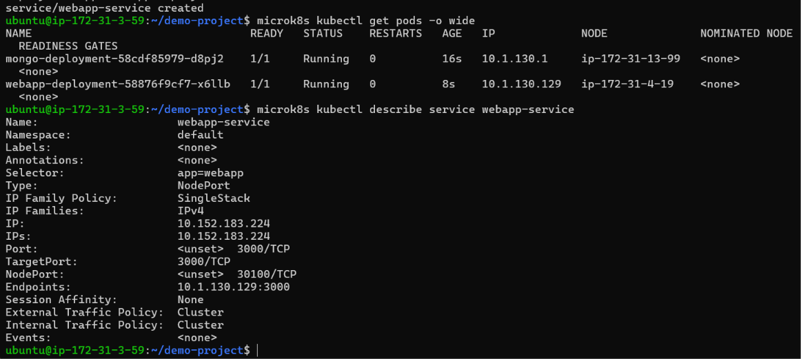
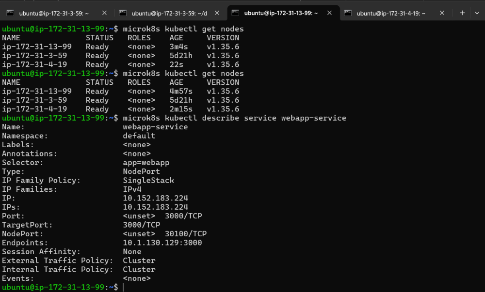
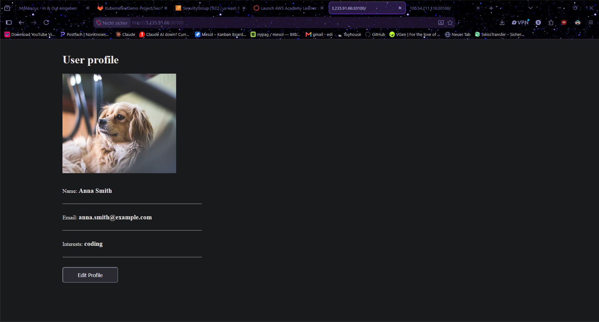
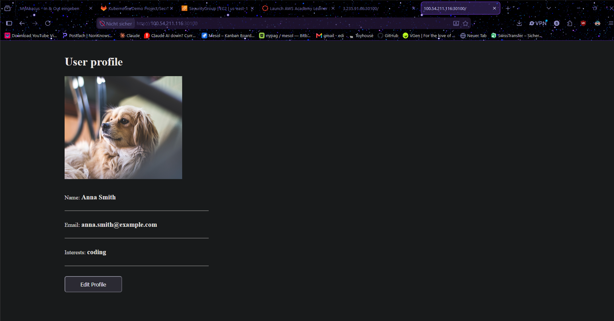
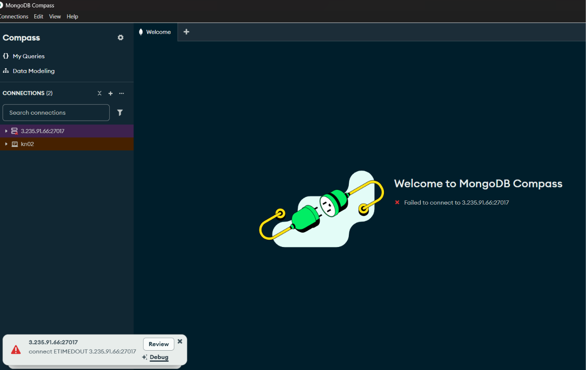
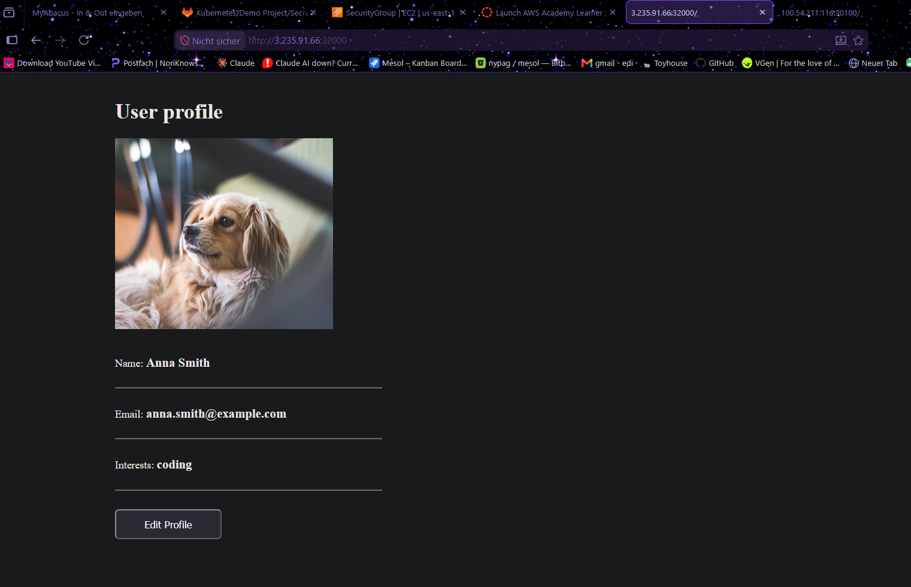
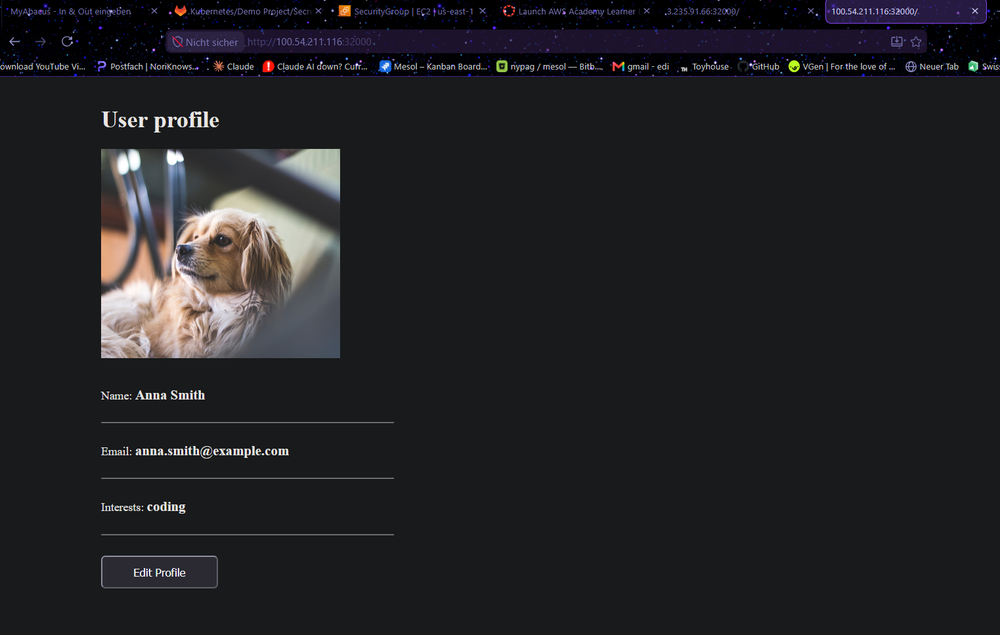
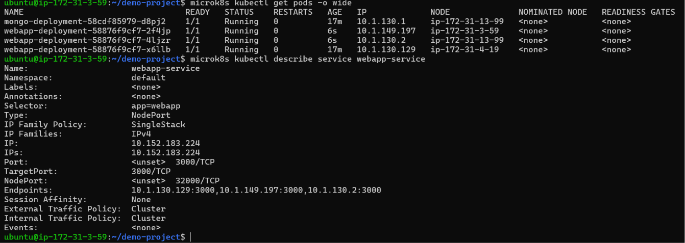

# KN07: Kubernetes II

## Inhaltsverzeichnis

- [A) Begriffe und Konzepte](#a-begriffe-und-konzepte)
  - [Pods vs. Replicas](#pods-vs-replicas)
  - [Service vs. Deployment](#service-vs-deployment)
  - [What problem does Ingress solve?](#what-problem-does-ingress-solve)
  - [What is a StatefulSet for?](#what-is-a-statefulset-for)
- [B) Demo Projekt](#b-demo-projekt)
  - [Deploying on the KN06 cluster](#deploying-on-the-kn06-cluster)
  - [Which service was not built as described, and why?](#which-service-was-not-built-as-described-and-why)
  - [Why the MongoUrl value is correct](#why-the-mongourl-value-is-correct)
  - [describe service on two nodes](#describe-service-on-two-nodes)
  - [Reaching the website from two nodes](#reaching-the-website-from-two-nodes)
  - [Connecting with MongoDB Compass (and why it fails)](#connecting-with-mongodb-compass-and-why-it-fails)
  - [Changing the port to 32000 and scaling to 3 replicas](#changing-the-port-to-32000-and-scaling-to-3-replicas)

---

## A) Begriffe und Konzepte

### Pods vs. Replicas

A **Pod** is the smallest unit Kubernetes runs: one (or a few tightly coupled) container(s) together with their shared network and storage. It is the actual running thing.

A **Replica** is not a separate object, it is simply *how many identical copies of a Pod* are running. You do not create these copies by hand; a controller (the ReplicaSet, which a Deployment manages) keeps the desired number of identical Pods alive and recreates one if it dies.

So a Pod is the thing, a replica is one copy of that thing, and the replica count is how many copies the controller keeps running.

### Service vs. Deployment

A **Deployment** manages the lifecycle of Pods. It creates them, keeps the desired number of replicas running, and handles rolling updates when the configuration changes.

Pods are disposable, though: they get a new IP address every time they restart. A **Service** solves this by putting a stable, single network address (and an internal DNS name) in front of a set of Pods and load-balancing traffic across them.

In short: a Deployment *runs and maintains* the Pods, while a Service *provides a stable way to reach* them.

### What problem does Ingress solve?

Exposing many services to the outside world with a separate NodePort or LoadBalancer for each one is wasteful and messy. Each service burns a port (or a paid cloud load balancer), and there are no clean URLs.

**Ingress** solves this by acting as a single entry point that routes incoming HTTP/HTTPS traffic to different internal services based on the hostname or the URL path (for example `/shop` to the shop service and `/api` to the api service), and it can terminate TLS in one central place. One door with smart routing, instead of one exposed port per service.

### What is a StatefulSet for?

A **StatefulSet** is for applications where each Pod needs a **stable identity**: a fixed name, a stable network hostname, and its own persistent storage that stays with it across restarts and rescheduling. A normal Deployment treats Pods as interchangeable and gives them random names, whereas a StatefulSet gives them ordered, sticky identities (`app-0`, `app-1`, `app-2`) that survive restarts.

**Example (not a database):** a **Kafka message-broker cluster**. Each broker needs to keep its own identity and its own on-disk data (its partitions), and the other brokers address it by a stable hostname. If a broker Pod restarts it must come back as the *same* broker with the *same* data, which is exactly what a StatefulSet guarantees. (Zookeeper, RabbitMQ, or an Elasticsearch cluster would work as examples too.)

---

## B) Demo Projekt

### Deploying on the KN06 cluster

The demo project was deployed on the three-node cluster from KN06 (two control-plane nodes and one worker). Four YAML files were created on the first control-plane node: a **ConfigMap** (the MongoDB endpoint), a **Secret** (the MongoDB user and password, base64-encoded), a **Deployment + Service for MongoDB** (internal), and a **Deployment + Service for the WebApp** (external, NodePort).

They were applied in dependency order, because the WebApp references the ConfigMap and Secret, and it depends on MongoDB:

```bash
microk8s kubectl apply -f mongo-config.yaml
microk8s kubectl apply -f mongo-secret.yaml
microk8s kubectl apply -f mongo.yaml
microk8s kubectl apply -f webapp.yaml
```

Both the `mongo-deployment` and the `webapp-deployment` Pods reached `Running`. The scheduler placed them on different nodes, which is fine: the WebApp is still reachable from any node thanks to the NodePort service.

### Which service was not built as described, and why?

The concepts explained in Part A (and the tutorial) say that a **database belongs in a StatefulSet**, because it is stateful: it needs a stable identity and persistent storage. In this demo project, however, **MongoDB is deployed as a plain Deployment**, not a StatefulSet, and its Pod has no persistent volume attached.

The reason is simplicity: for a small demo it is easier to run MongoDB as an ordinary Deployment. The trade-off is that a Deployment treats its Pods as interchangeable and ephemeral, so if the MongoDB Pod is restarted or rescheduled, its data is lost. A production database would instead use a StatefulSet with persistent volumes so that the data survives restarts and each database node keeps a stable identity.

### Why the MongoUrl value is correct

In `mongo-config.yaml` the value is:

```yaml
data:
  mongo-url: mongo-service
```

This value is correct because `mongo-service` is exactly the `metadata.name` of the MongoDB Service. Kubernetes runs an internal DNS (CoreDNS), and every Service is discoverable inside the cluster by its name. When the WebApp reads `DB_URL = mongo-service`, cluster DNS resolves that name to the ClusterIP of the MongoDB Service, which then forwards the traffic to the MongoDB Pod on port 27017.

Using the Service name rather than a Pod IP is important, because Pod IPs change on every restart, whereas the Service name (and its ClusterIP) stays stable. So the WebApp always reaches the database through a fixed, reliable address.

### describe service on two nodes

`microk8s kubectl describe service webapp-service` was run on the two control-plane nodes (the worker cannot run `kubectl`, as seen in KN06). Both nodes return the same result, because every control-plane node holds a copy of the cluster state.


*`describe service webapp-service` on `microk8s-1`: type `NodePort`, NodePort `30100`, one endpoint.*


*The same command on `microk8s-2` returns identical output.*

### Reaching the website from two nodes

The `webapp-service` is of type **NodePort**, which the description confirms (`NodePort: 30100/TCP`). MicroK8s maps a NodePort onto **every** node's host IP, so the app is reachable at `http://<node-public-ip>:30100` on any node in the cluster, no matter which node the Pod actually runs on.

**What had to be done:** open port **30100** in the AWS security group (inbound, Custom TCP, source `0.0.0.0/0`), then open the app in the browser using a node's **public** IP (not the private `172.31.x.x` address). Testing with `curl localhost:30100` on a node returned `200` before the port was opened, which confirmed the app itself was healthy and only the AWS firewall was blocking outside access.


*The demo app reached at `http://3.235.91.66:30100` (node1).*


*The same app reached at `http://100.54.211.116:30100` (node2).*

### Connecting with MongoDB Compass (and why it fails)

Connecting to MongoDB from a laptop with MongoDB Compass (`mongodb://<node-public-ip>:27017`) fails with a connection timeout.


*MongoDB Compass: `connect ETIMEDOUT` when trying to reach the node on port 27017.*

**Why it fails:** the `mongo-service` has no `type:` set, so it defaults to **ClusterIP**. A ClusterIP service is reachable only from *inside* the cluster, which is exactly why the WebApp can talk to MongoDB but the laptop cannot. There is no NodePort mapping MongoDB's port 27017 onto the host IPs, and even if there were, port 27017 is not open in the AWS security group. From outside there is simply no route to the database.

**What could be changed to make it work:** give the `mongo-service` `type: NodePort` and a `nodePort` in the 30000–32767 range, re-apply it, and open that port in the AWS security group. Compass could then reach MongoDB at `<node-public-ip>:<nodePort>`.

Note that this would only be done for debugging: exposing a database directly to the internet is bad practice, which is the same reason the database is kept internal (ClusterIP) in the first place.

### Changing the port to 32000 and scaling to 3 replicas

The WebApp definition was changed to expose port **32000** instead of 30100, and the replicas were raised from 1 to **3**.

**Steps performed:**

1. In `webapp.yaml`, change the Service's `nodePort: 30100` to `nodePort: 32000`, and the Deployment's `replicas: 1` to `replicas: 3`.
2. Re-apply with `microk8s kubectl apply -f webapp.yaml`. Because `apply` is declarative, Kubernetes reconciles the existing objects to match the new file (the output says `configured`, not `created`): it starts 2 additional WebApp Pods and moves the external port.
3. Open port **32000** in the AWS security group (the old port 30100 stops serving).
4. Verify that 3 WebApp Pods are `Running` and that the page loads on the new port.


*The app now reachable at `http://3.235.91.66:32000` (node1).*


*The same app at `http://100.54.211.116:32000` (node2).*

**Do you see the difference in the replicas?** Yes. `microk8s kubectl get pods` now shows **three** `webapp-deployment-...` Pods (spread across all three nodes), and the `describe service webapp-service` output reflects this on the **Endpoints** line: it now lists **three** Pod IPs on port 3000, instead of the single endpoint from before. The Service load-balances incoming requests across all three replicas.


*Three WebApp Pods `Running`; `describe service` shows `NodePort: 32000/TCP` and three endpoints.*

---

> **HINWEIS:** This project runs on the KN06 cluster. If the instances are stopped afterwards, the cluster and the deployed app will need to be recreated.
