# KN08: Kubernetes III - Microservices

## Inhaltsverzeichnis

- [Overview](#overview)
- [1-3 Prerequisites: Database, Account, Frontend](#1-3-prerequisites-database-account-frontend)
- [4-5 Integration test in Docker](#4-5-integration-test-in-docker)
- [6 Implementing BuySell and SendReceive](#6-implementing-buysell-and-sendreceive)
- [7 Kubernetes deployment](#7-kubernetes-deployment)
- [8 Rolling update](#8-rolling-update)
- [9 Improvement 1: Multistage Dockerfile and runtime environment variables](#9-improvement-1-multistage-dockerfile-and-runtime-environment-variables)
- [10 Improvement 2: LoadBalancer](#10-improvement-2-loadbalancer)

---

## Overview

The application is a small crypto wallet ("tbzCoin") built from four microservices:

| Service | Given/Own | Role |
|---------|-----------|------|
| Frontend | given | React app; calls the other services from the browser |
| Account | given | The only service that talks to the database; manages holdings and friends |
| BuySell | **own** | Buys and sells coins for the logged-in user |
| SendReceive | **own** | Sends coins from the user to a friend |

BuySell and SendReceive never touch the database directly. They call the **Account** service over HTTP, which keeps the database access in a single place. A tbzCoin has a fixed value and no decimals; the smallest unit is 1.

---

## 1-3 Prerequisites: Database, Account, Frontend

**Database.** A MariaDB database was created on AWS RDS (free tier) and the provided `m347_KN08_DB.sql` was loaded into it. The script creates the `users` and `friends` tables and inserts five users. The RDS security group was opened on port 3306 so the data could be imported from the local machine with the MariaDB client.

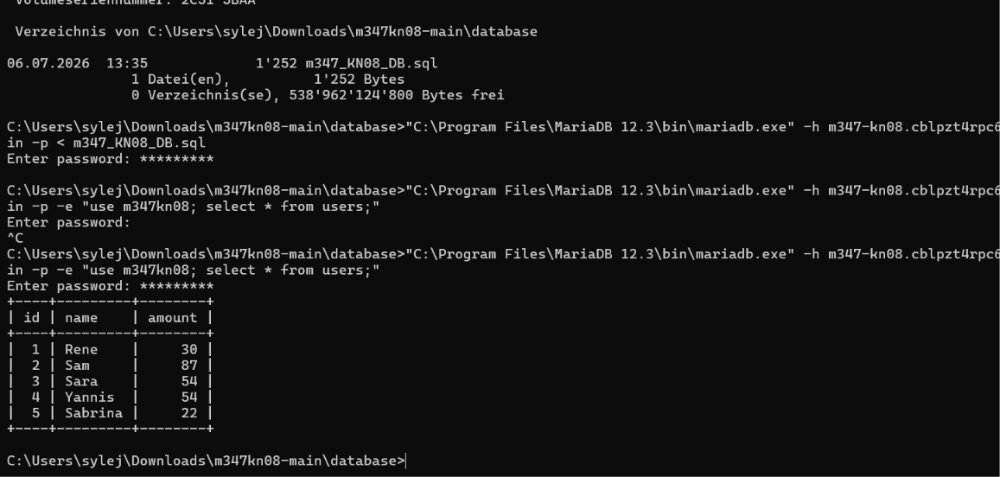
*The five seed users after importing the SQL file.*

**Account.** The Account service is a provided .NET application. Its `appsettings.json` was filled in with the RDS connection string, then it was containerized with the provided Dockerfile and run on port 8080. Swagger confirms the service is up and connected to the database.

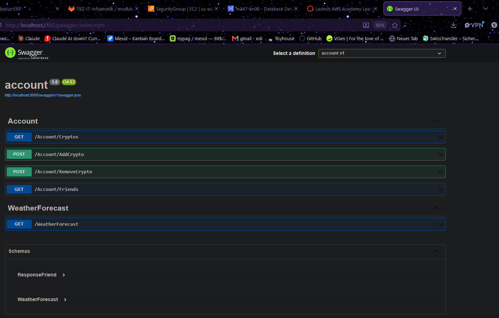
*The Account API: `GET /Account/Cryptos`, `POST /Account/AddCrypto`, `POST /Account/RemoveCrypto`, `GET /Account/Friends`. (`WeatherForecast` is leftover .NET template boilerplate.)*

The endpoints my own services need to call are:

| Endpoint | Method | Parameters | Returns |
|----------|--------|------------|---------|
| `/Account/Cryptos` | GET | `userId` (query) | a number (the user's holdings) |
| `/Account/AddCrypto` | POST | `userId`, `amount` (query) | `true` |
| `/Account/RemoveCrypto` | POST | `userId`, `amount` (query) | `true` |
| `/Account/Friends` | GET | `userId` (query) | array of `{ id, name }` |

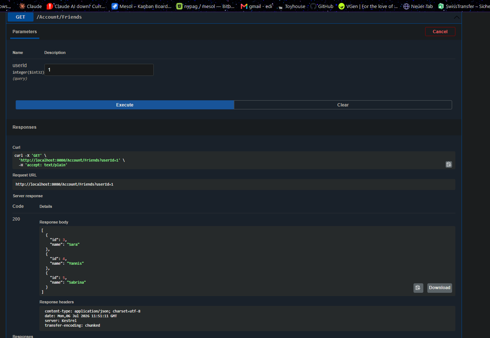
*`GET /Account/Friends?userId=1` returns user 1's friends (Sara, Yannis, Sabrina), matching the database.*

**Frontend.** The Frontend is a finished React app that is not modified (only built and containerized). Its Dockerfile serves a pre-built `build/` folder with nginx on port 80. The service URLs are provided through environment variables.

---

## 4-5 Integration test in Docker

Before moving to Kubernetes, all components were run together in Docker Desktop to confirm they work as a whole. The frontend was built with URLs pointing at the locally published ports (account on 8080, buysell on 8002, sendreceive on 8003) and served on port 3000. Holdings and the friends list load, and Buy/Sell/Send all work through the two implemented services.

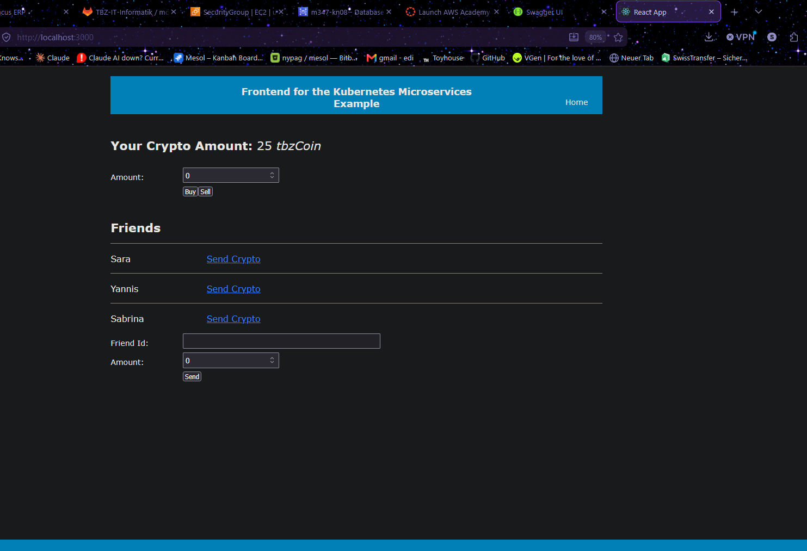
*The full application running locally in Docker, with live data from the Account service and database.*

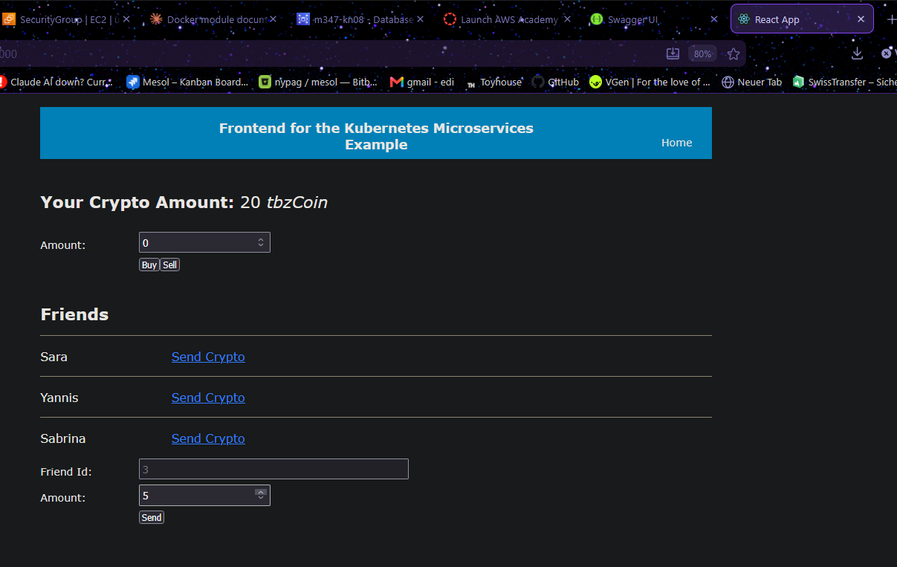
*Selecting a friend fills the Friend Id automatically; sending coins updates the balance.*

**Note on the two builds.** Environment variables in a React app are evaluated at **build time** and baked into the JavaScript. The URLs are different for Docker (localhost) and Kubernetes (node IP + NodePort), so the frontend has to be built twice. This limitation is later removed in step 9.

---

## 6 Implementing BuySell and SendReceive

Both services are small Node.js/Express servers. Each receives a request from the frontend and calls the Account service; neither talks to the database. The Account URL is read from an environment variable (`ACCOUNT_URL`) so the same image works in every environment.

**BuySell** (port 8002):

- `POST /buy` `{ id, amount }` -> calls `AddCrypto` -> returns `true`.
- `POST /sell` `{ id, amount }` -> reads the current holdings first; a user can never sell more than they own, so the amount removed is capped at the current balance (the total is set to 0 at most). Returns `true`.

**SendReceive** (port 8003):

- `POST /send` `{ id, receiverId, amount }` -> (1) checks that the receiver is actually in the sender's friend list, (2) checks that the sender has enough coins, then (3) removes the amount from the sender and adds it to the receiver. Returns `true`, or `false` if the receiver is not a friend or the balance is too low.

The two services were built as Docker images and tested against the running Account container. The tests confirm the buy logic, the transfer, and the friend validation.

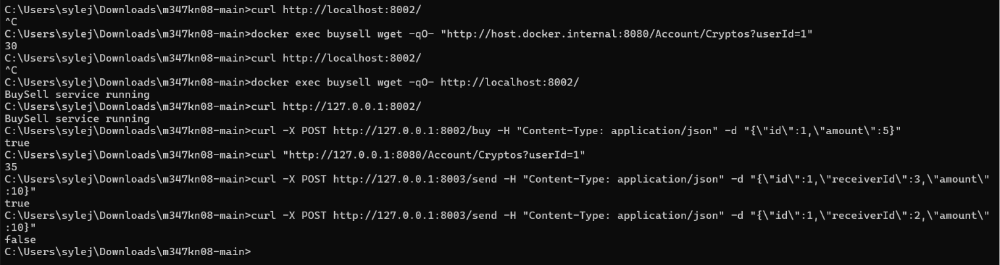
*`/buy` returns `true` and the balance rises to 35; `/send` to friend 3 returns `true`; `/send` to non-friend 2 returns `false` (the friend check works).*

---

## 7 Kubernetes deployment

The previous KN07 demo objects were removed from the cluster, and the five new components were deployed onto the three-node cluster from KN06/07.

**Getting the images to the cluster.** Unlike the KN07 demo (which used public Docker Hub images), my images only existed locally. They were tagged and pushed to Docker Hub (`ediguy/account`, `ediguy/buysell`, `ediguy/sendreceive`, `ediguy/frontend`) so Kubernetes could pull them.

**The manifests.** Following the demo-app pattern with the necessary changes:

- **ConfigMap** — the in-cluster Account URL, `http://account-service:8080`. Inside the cluster, services reach each other by their **Service name** (Kubernetes DNS resolves it to the service's ClusterIP), exactly like `mongo-service` in KN07. This value is injected into buysell and sendreceive as `ACCOUNT_URL`.
- **Secret** — the database connection string, injected into the Account container as the `ConnectionString` environment variable (ASP.NET Core lets an environment variable override the same key in `appsettings.json`).
- **Deployments** — one per service (account, buysell, sendreceive, frontend).
- **Services** — all of type **NodePort**, because the browser (outside the cluster) has to reach them: account 30080, buysell 30002, sendreceive 30003, frontend 30000. A NodePort service still has a ClusterIP too, so account is reachable both in-cluster (by name) and from the browser (by node IP + NodePort). The four NodePorts were opened in the AWS security group.

The three backend services were deployed first and reached `Running`.

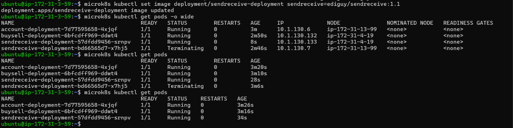
*account, buysell and sendreceive running in the cluster.*

**Browser-vs-in-cluster URLs.** This is the key difference from Docker. Services talking to each other *inside* the cluster use the Service name (`http://account-service:8080`). But the frontend runs in the **browser**, so the URLs it calls must be reachable from outside — a node's public IP plus the NodePort. The frontend was therefore rebuilt (build #2) with `http://<node-ip>:30080/...` etc. and deployed last.

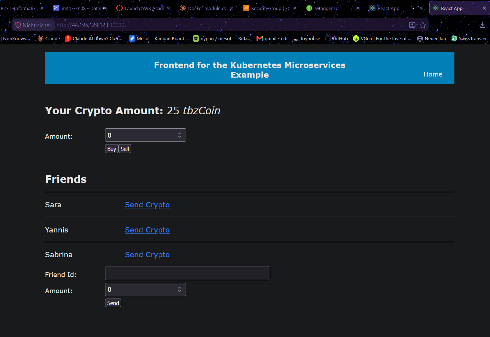
*The application served from the cluster through the frontend NodePort (node public IP :30000), with live data.*

---

## 8 Rolling update

To show how easily Kubernetes rolls out an update, the frontend title text was changed (to "Edis crypto shop"), the image was rebuilt and pushed with a new tag, and the deployment was updated to that image. Kubernetes keeps the old pod serving until the new one is ready, then swaps them — so the update happens with no downtime.

The rollout was triggered with `kubectl set image` and watched with `kubectl rollout status`.

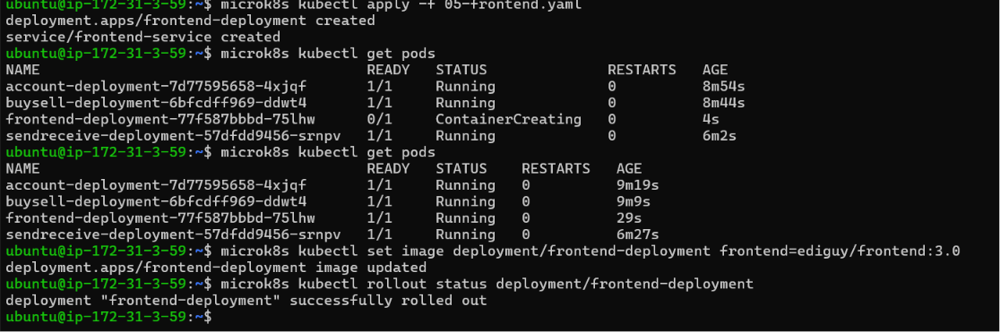
*`kubectl rollout status` confirms the deployment was successfully rolled out.*

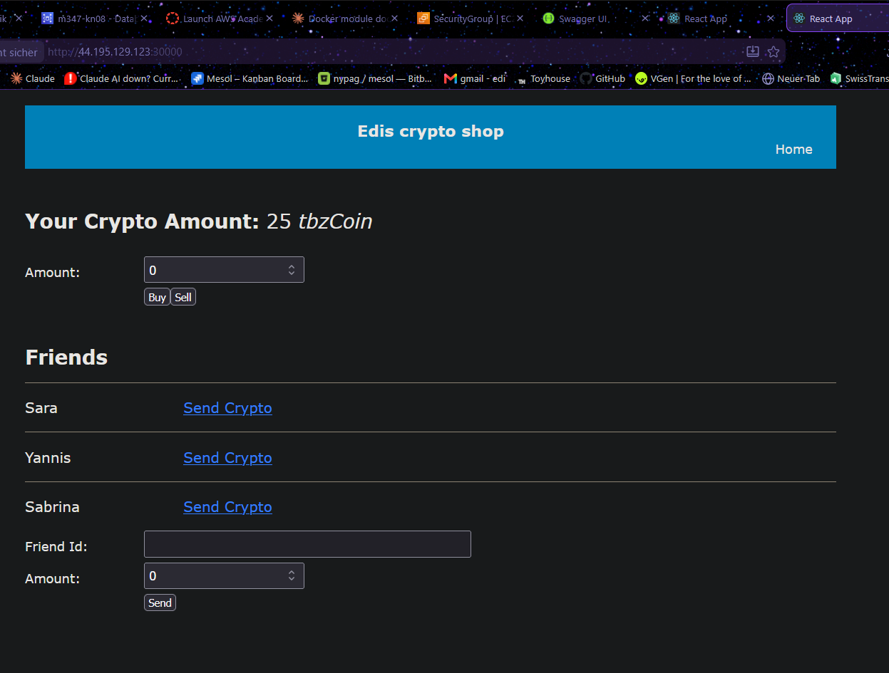
*The new title is live, served from the cluster — the update rolled out without downtime.*

---

## 9 Improvement 1: Multistage Dockerfile and runtime environment variables

Two problems were fixed here.

**Multistage Dockerfile.** Previously the frontend had to be built manually with `npm run build` before creating the image. The new Dockerfile does this in two stages: stage 1 (Node) runs the build inside the image, and stage 2 (nginx) serves the result. No manual build step is needed anymore.

**Runtime environment variables.** React bakes environment variables into the JavaScript at build time, which is exactly why the frontend had to be built twice (once per environment). A multistage build does not solve this on its own. The fix is to run a small script **before nginx starts**: the app is built with placeholder tokens (`FRONTEND_MS_*`) instead of real URLs, and at container startup a script replaces those placeholders in the built JavaScript with the values of environment variables. With this, the real URLs come from Kubernetes at runtime, so a single image works in any environment — no more rebuilding.

The frontend was rebuilt this way (the URLs now come from a `frontend-config` ConfigMap injected as environment variables) and redeployed. It works identically to before, but the image is now environment-independent.

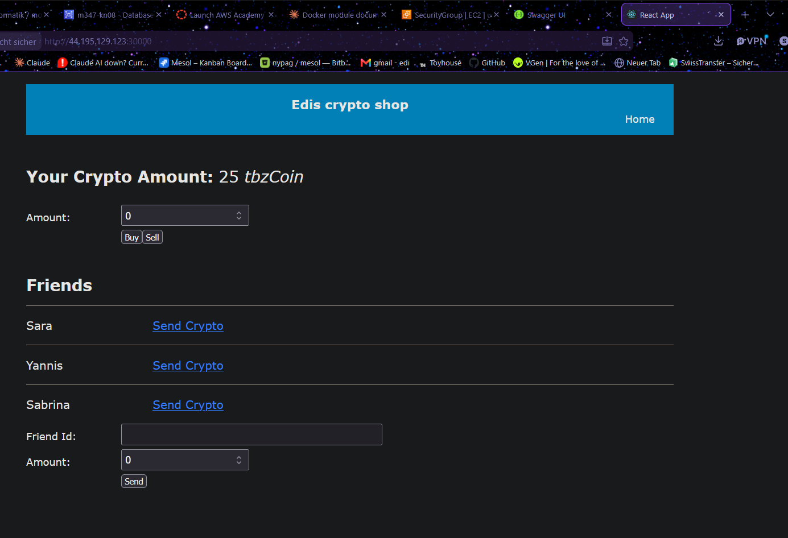
*The application served from the cluster. The service URLs were injected at container startup from the ConfigMap, not baked in at build time.*

---

## 10 Improvement 2: LoadBalancer

Until now the application was reached through a single node's public IP. That is fragile: if that specific node is shut down, the application becomes unreachable. A load balancer solves this by sitting in front of all three nodes and routing to a healthy one.

An **AWS Application Load Balancer** was created (internet-facing) with:

- a **listener on port 30000** (the frontend NodePort),
- a **target group** of type *Instances* containing all three cluster nodes on port 30000, with an HTTP health check on `/`,
- the cluster security group attached so the load balancer can reach the nodes.

Once the load balancer became active and the targets healthy, the application is reachable through the load balancer's stable DNS name instead of a single node IP. If one node goes down, the load balancer simply routes to another.

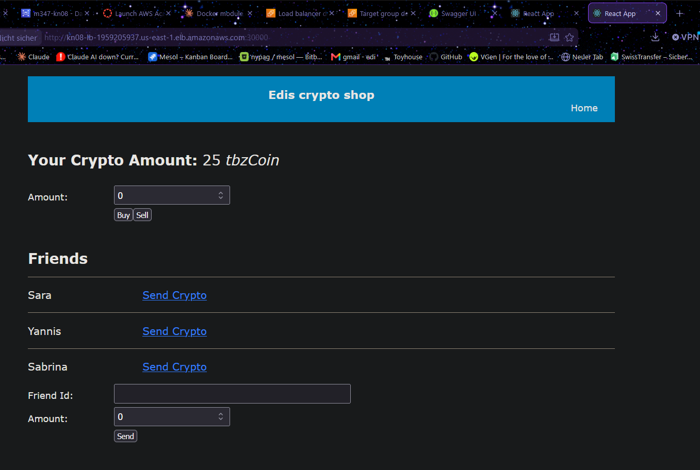
*The application served through the AWS load balancer's DNS name (`kn08-lb-...elb.amazonaws.com:30000`) — no longer tied to a single node.*

---

## Result

The full microservices application — database, Account, the two self-implemented services (BuySell, SendReceive), and the frontend — runs on a three-node Kubernetes cluster on AWS, is configured at runtime through ConfigMaps and Secrets, can be updated without downtime, and is reached through an AWS load balancer.